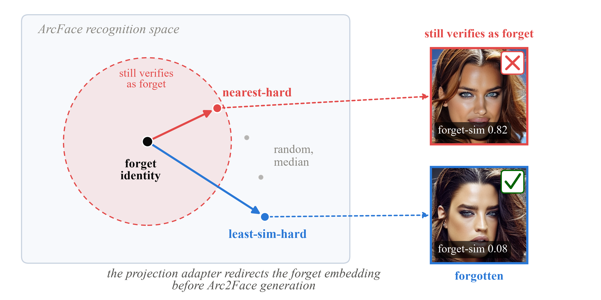
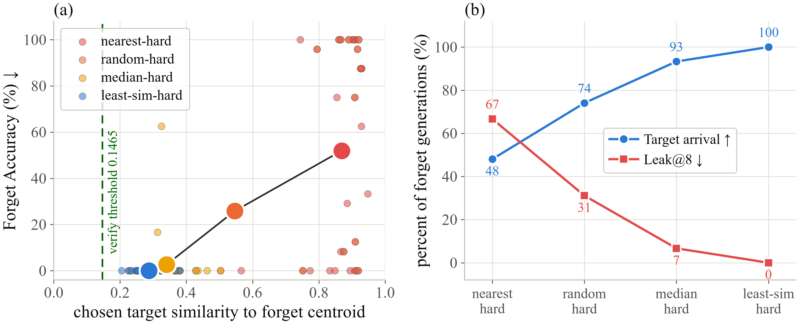

# The Nearest Target Is the Wrong One

This repository accompanies *The Nearest Target Is the Wrong One: Target
Separation in Arc2Face Identity Unlearning*, accepted at the [3rd
Workshop and Challenge on Unlearning and Model Editing (U&ME), ECCV
2026](https://eccv.ecva.net/Conferences/2026/Workshops). The official
proceedings link will be added when it becomes available.

It includes the experiment code, final figures, public-identity exclusion
split, and the saved results needed to recompute the paper tables. CelebA,
pretrained models, generated images, checkpoints, and intermediate outputs are
not included.

## Main result

Increasing target separation reduces forgetting failure and worst-case identity
leakage while retaining about 89% accuracy on retained identities. The values
below use the reporting precision from the paper: two decimal places, except
for mean cosine similarity, which uses four.

| Policy | FA=0 groups | Mean FA ↓ | Mean RA ↑ | Mean ERB ↑ | Mean Leak@8 ↓ | Mean sim. | RA_target ↑ | RA_hard ↑ | RA_random ↑ | SER-FIQ ≥ real ↑ | GraFIQs ≥ real ↑ |
| --- | ---: | ---: | ---: | ---: | ---: | ---: | ---: | ---: | ---: | ---: | ---: |
| nearest-hard | 9/30 | 51.94 | 88.79 | 50.34 | 66.67 | 0.8689 | 53.89 | 79.81 | 97.85 | 70.28% | 10.64% |
| random-hard | 20/30 | 25.83 | 88.86 | 71.81 | 31.11 | 0.5460 | 77.08 | 79.96 | 97.85 | 70.48% | 10.77% |
| median-hard | 28/30 | 2.64 | 88.75 | 92.35 | 6.67 | 0.3403 | 92.22 | 79.78 | 97.80 | 69.62% | 10.81% |
| least-sim-hard | 30/30 | 0.00 | 88.86 | 93.84 | 0.00 | 0.2874 | 94.28 | 79.90 | 97.89 | 69.07% | 11.12% |

FA and Leak@8 are lower-is-better. RA, ERB, and the two quality comparisons
are higher-is-better.

<p align="center">
  <a href="paper_assets/figures/intro_teaser.pdf">
    
  </a>
</p>

<p align="center"><em>Target separation controls whether the redirected embedding still verifies as the forgotten identity. Click for the PDF.</em></p>

<p align="center">
  <a href="paper_assets/figures/expanded_mechanistic_summary.pdf">
    
  </a>
</p>

<p align="center"><em>Across 30 groups and four policies, greater separation reduces forgetting failure and leakage. Click for the PDF.</em></p>

<details>
<summary><strong>Installation</strong></summary>

Experiments used Python 3.12 and CUDA 12.8. To recreate that environment:

```powershell
py -3.12 -m venv venv
venv\Scripts\python.exe -m pip install -r paper_artifacts\reproducibility\requirements-paper-cu128.lock
```

`requirements.txt` lists compatible lower bounds for development. The lock file
records the versions used for the paper.

</details>

<details>
<summary><strong>Data and pretrained models</strong></summary>

Download the aligned CelebA images and annotations from the [official CelebA
page](https://mmlab.ie.cuhk.edu.hk/projects/CelebA.html), subject to its access
and non-commercial research terms. The identity annotation may require a
request to the dataset maintainers.

Place aligned images in `Data/img_align_celeba/`; place
`identity_CelebA.txt` and `list_landmarks_align_celeba.txt` in `Data/Anno/`;
and place CelebA's `list_eval_partition.txt` directly in `Data/`. The tracked
`Data/validation-splits.json` excludes public validation identities. The paper
uses official partition 0 followed by a deterministic, disjoint internal
fitting/evaluation reference split. A complete input contains 202,599 aligned
images across 10,177 identities; preparation fails if images or annotations
are incomplete.

The expected working layout is:

```text
Data/
├── validation-splits.json          # included
├── list_eval_partition.txt         # CelebA annotation
├── Anno/
│   ├── identity_CelebA.txt
│   └── list_landmarks_align_celeba.txt
└── img_align_celeba/
    └── *.jpg

models/
├── Arc2Face/
├── insightface/models/antelopev2/
├── adaface/
└── official_quality/

configs/                             # generated by build_group_configs.py
outputs/                             # generated experiment outputs
```

Clone Arc2Face directly into `models/Arc2Face/`, check out the paper revision,
and run the downloader for its weights and matching ArcFace recognizer:

```powershell
git clone https://github.com/foivospar/Arc2Face models\Arc2Face
git -C models\Arc2Face checkout 8f3acd701d17fda7fde4c9f1d170fc88fecbe9ad
venv\Scripts\python.exe scripts\setup\download_arc2face.py `
  --out-dir models\Arc2Face `
  --arcface-recognizer-dir models\insightface\models\antelopev2
```

Download and unpack InsightFace
[`antelopev2`](https://github.com/deepinsight/insightface/tree/master/python-package)
under `models/insightface/models/antelopev2/`. That folder must contain
`1k3d68.onnx`, `2d106det.onnx`, `genderage.onnx`, `scrfd_10g_bnkps.onnx`, and
the downloaded `arcface.onnx`. Remove or rename `glintr100.onnx` so InsightFace
loads the intended recognizer.

Clone [AdaFace](https://github.com/mk-minchul/AdaFace) into
`models/adaface/`, then download the authors' R50 WebFace4M checkpoint and
place it at `models/adaface/weights/adaface_ir50_webface4m.ckpt`:

```powershell
git clone https://github.com/mk-minchul/AdaFace models\adaface
```

The face-quality evaluation uses two further official repositories. Clone them
at the paths expected by the scoring code:

```powershell
git clone https://github.com/pterhoer/FaceImageQuality.git models\official_quality\ser_fiq_source
git -C models\official_quality\ser_fiq_source checkout 611296605db57b8d50518fd5911d5111eeb52747

git clone https://github.com/jankolf/grafiqs.git models\official_quality\grafiqs_source
git -C models\official_quality\grafiqs_source checkout 8d11a1f8506fb0f86ebd7738afc31467e2a01058
```

SER-FIQ also requires the authors' MXNet model, which is converted locally to
the ONNX trunk and head used by the scorer. GraFIQs uses the cloned source with
the authors' `resnet100_ms1mv2_arcface.pth` checkpoint. The download locations,
required paths, conversion commands, and validation steps are in
[`extras/serfiq/README.md`](extras/serfiq/README.md).

[Stable Diffusion v1.5](https://huggingface.co/stable-diffusion-v1-5/stable-diffusion-v1-5)
is resolved through the Hugging Face cache at revision
`451f4fe16113bff5a5d2269ed5ad43b0592e9a14`. Recorded model hashes and paths
are in `paper_artifacts/reproducibility/models.lock.json`.

</details>

<details>
<summary><strong>Fast reproduction from the paper artifacts</strong></summary>

`paper_artifacts/` contains the run metrics, per-image predictions, generation
attempts, selected adapter states, target selections, quality scores,
secondary-recognizer results, and sensitivity results. The paper tables can be
recomputed without training adapters or generating images:

```powershell
venv\Scripts\python.exe scripts\reproducibility\recompute_paper_tables.py `
  --json-output paper_artifacts\recomputed_paper_tables.json
```

The command prints the tables and writes full-precision values to
`paper_artifacts/recomputed_paper_tables.json`. See
[`paper_artifacts/README.md`](paper_artifacts/README.md) for the file layout.

</details>

<details>
<summary><strong>Full experiment reproduction</strong></summary>

Run all commands from the repository root. `outputs/` and `configs/` are
generated and ignored by Git.

### 1. Prepare identities, groups, and calibration

```powershell
venv\Scripts\python.exe scripts\data_prep\prepare_identities.py `
  --data-dir Data `
  --out-dir outputs\prep `
  --public-splits Data\validation-splits.json `
  --arcface-model-root models\insightface `
  --device cuda `
  --partitions 0 `
  --min-images-per-identity 15 `
  --expanded-forget-count 30 `
  --fit-reference-count 3 `
  --eval-reference-count 3
```

This creates the identity and reference splits, train-pool embeddings, FAR
calibration, 30 hard-neighbour groups, and benchmark metadata in
`outputs/prep/`.

### 2. Generate configs and preflight the gallery

```powershell
venv\Scripts\python.exe scripts\configs\build_group_configs.py `
  --benchmark outputs\prep\benchmark.json `
  --out-dir configs\expanded

venv\Scripts\python.exe scripts\evaluation\validate_gallery_references.py
```

The first command writes one adapter config per group to `configs/expanded/`.
The second checks every held-out gallery image and writes its report to
`outputs/prep/`.

### 3. Train, generate, and evaluate the four policies

```powershell
foreach ($policy in "nearest-hard", "random-hard", "median-hard", "least-sim-hard") {
  venv\Scripts\python.exe scripts\sweeps\run_expanded_target_selection_sweep.py `
    --policy $policy `
    --evaluation-device cuda `
    --reference-det-thresh 0.5 `
    --evaluation-det-thresh 0.1 `
    --random-seed 2026 `
    --skip-if-exists
}
```

For each policy, this trains 30 rank-8 adapters, selects a checkpoint, generates
168 images per group, and evaluates them against the held-out gallery. Adapters,
manifests, images, per-image predictions, metrics, and policy summaries are
written below `outputs/`.

### 4. Aggregate the main results

```powershell
venv\Scripts\python.exe scripts\evaluation\build_expanded_mechanistic_summary.py
```

This writes the group-level and policy-level results to
`outputs/expanded_summary/`.

### 5. Reproduce sensitivity and additional evaluations

```powershell
venv\Scripts\python.exe scripts\configs\prepare_expanded_sensitivity_variants.py `
  --base-benchmark outputs\prep\benchmark.json `
  --counts 10 20 `
  --benchmarks-root outputs\sensitivity\benchmarks `
  --configs-root configs\sensitivity

venv\Scripts\python.exe scripts\evaluation\compare_expanded_sensitivity.py `
  --benchmarks-root outputs\sensitivity\benchmarks `
  --results-root outputs\sensitivity\runs `
  --canonical-results-root outputs `
  --counts 10 20 `
  --policies nearest-hard random-hard median-hard least-sim-hard `
  --out-dir outputs\sensitivity\comparison

venv\Scripts\python.exe scripts\evaluation\calibrate_adaface_threshold.py
venv\Scripts\python.exe scripts\evaluation\verify_with_adaface.py
venv\Scripts\python.exe scripts\evaluation\validate_large_gallery_leakage.py

venv\Scripts\python.exe scripts\evaluation\build_official_quality_scores.py `
  --scope all `
  --output-dir outputs\quality_official_v1 `
  --ser-fiq-trunk-model models\official_quality\ser_fiq_arcface_trunk_b1.onnx `
  --ser-fiq-head-model models\official_quality\ser_fiq_arcface_head_t100.onnx
venv\Scripts\python.exe scripts\evaluation\build_official_quality_comparison.py `
  --input-dir outputs\quality_official_v1
```

These commands produce the top-10/top-20 sensitivity comparison, AdaFace
verification, large-gallery leakage predictions, and face-quality comparison
below `outputs/`.

### 6. Build the paper artifacts and tables

```powershell
venv\Scripts\python.exe scripts\reproducibility\build_paper_artifacts.py --overwrite
venv\Scripts\python.exe scripts\reproducibility\recompute_paper_tables.py `
  --json-output paper_artifacts\recomputed_paper_tables.json
```

The first command collects the completed evaluation outputs in
`paper_artifacts/`; the second recomputes the published tables from those files.

</details>

<details>
<summary><strong>Hardware, runtime, and determinism</strong></summary>

The 30-group, four-policy adapter-training, generation, and ArcFace sweep took
approximately 12 hours on an NVIDIA GeForce RTX 5070 with 12,227 MiB. Official
SER-FIQ/GraFIQs scoring took approximately 65 minutes. The complete run used
about 17.6 GB for working outputs; `paper_artifacts/` is about 0.01 GB.

Identity selection, reference splitting, calibration sampling, target controls,
training, and generation seeds are fixed. Diffusion output may still differ
across GPU architectures, drivers, CUDA versions, and library versions. The
saved artifacts reproduce the reported table values without depending on those
pixel-level differences.

</details>

<details>
<summary><strong>Environment verification</strong></summary>

Check the package versions and required external model files. The optional
second command also checks pretrained-model hashes:

```powershell
venv\Scripts\python.exe scripts\reproducibility\verify_reproducibility.py
venv\Scripts\python.exe scripts\reproducibility\verify_reproducibility.py --verify-model-hashes
```

</details>

<details>
<summary><strong>Tests</strong></summary>

```powershell
venv\Scripts\python.exe -m unittest discover -s tests -v
```

</details>

<details>
<summary><strong>Official SER-FIQ model conversion and validation</strong></summary>

SER-FIQ uses an ONNX conversion of the authors' MXNet model. The source commits,
checkpoint hashes, Docker conversion, split-model creation, and MXNet-vs-ONNX
validation commands are in
[`extras/serfiq/README.md`](extras/serfiq/README.md).

</details>

<details>
<summary><strong>Figures and figure building</strong></summary>

The remaining paper figures are available as PDFs:

- [Hardness distribution](paper_assets/figures/hardness_histogram.pdf)
- [Forget-identity resemblance](paper_assets/figures/forget_resemblance.pdf)
- [Secondary-recognizer results](paper_assets/figures/second_recognizer.pdf)

After the corresponding evaluation outputs exist, rebuild every figure with:

```powershell
venv\Scripts\python.exe scripts\figures\build_intro_teaser.py
venv\Scripts\python.exe scripts\figures\build_hardness_histogram.py
venv\Scripts\python.exe scripts\figures\build_mechanistic_summary.py
venv\Scripts\python.exe scripts\figures\build_forget_resemblance.py
venv\Scripts\python.exe scripts\figures\build_second_recognizer.py
```

</details>
